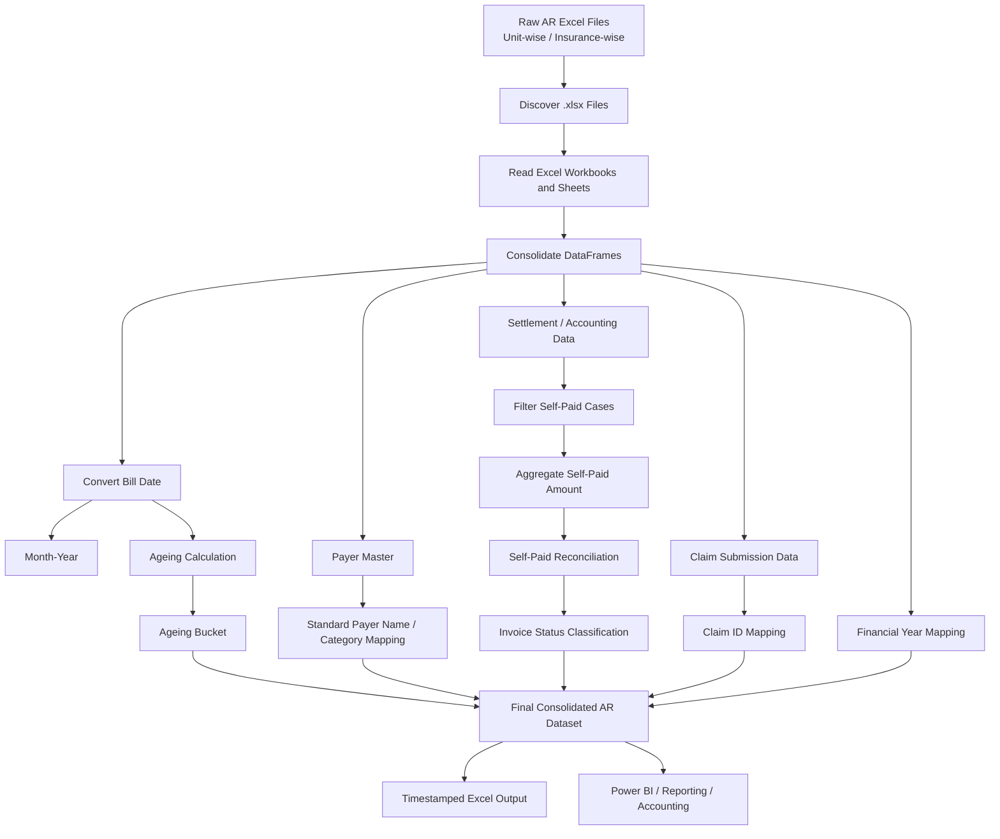

# AR Outstanding Data Transformation & Consolidation Pipeline

## Overview

## 🔒 Data & Confidentiality Notice

Important: All datasets included in this repository are completely synthetic and dummy datasets created solely for demonstration, learning, and portfolio purposes. They do not contain, represent, or reproduce any confidential, proprietary, patient, financial, operational, or personally identifiable information from any real healthcare organization.

The terminology, field names, transaction types, and business concepts used in this project are generic examples commonly associated with healthcare Accounts Receivable (AR), insurance billing, collections, and reconciliation workflows. They are intended only to demonstrate the data-processing and analytics approach.

This project does not disclose, expose, or rely upon any confidential company data, patient information, protected health information (PHI), personally identifiable information (PII), or proprietary business logic. The synthetic data has been independently created and is not intended to represent actual records or real-world individuals.

No inference about any healthcare organization, patient, insurer, transaction, or business process should be made from the synthetic data or examples in this repository.


## This project automates the preparation of **Accounts Receivable (AR) outstanding data** received as raw Excel accounting dumps.

## The pipeline replaces a largely manual Excel-based process with a Python/Pandas workflow that:

- Reads raw AR files received **unit-wise or insurance-wise**
- Consolidates multiple Excel workbooks/sheets into one dataset
- Standardizes dates and derives **Month-Year**
- Assigns **Financial Year**
- Calculates bill **Ageing** from Bill Date to the current date
- Assigns bills to predefined ageing buckets
- Maps payer/party names to standardized payer names and categories
- Reads settlement/accounting data and identifies **Self-Paid** cases
- Reconciles self-paid amounts against bill amounts and outstanding balances
- Classifies each record into an **Invoice Status**
- Maps **Claim ID** from claim-submission data
- Performs payer/category blank checks
- Converts payment bill numbers to numeric values where required
- Exports the final consolidated AR dataset to Excel with a timestamped filename

The main purpose is to produce a current, analysis-ready AR dataset quickly enough for downstream accounting work, Excel reporting, Power BI reporting, and cross-functional stakeholder use.

---

## Business Problem

The original process depended heavily on manual Excel preparation.

For large insurance-wise accounting dumps, the team may need to:

1. Download multiple unit-wise or insurance-wise AR files.
2. Open and consolidate the files manually.
3. Handle very large datasets, sometimes reaching approximately **800,000 rows**.
4. Perform multiple lookups to map:
   - Standard payer name
   - Payer category
   - Claim ID
   - Other reference/master data
5. Calculate bill ageing.
6. Assign ageing buckets.
7. Review outstanding amounts.
8. Identify unpaid, partially paid, unapplied, and non-AR records.
9. Account based on the **latest available AR outstanding position**.
10. Repeat the preparation several times because AR can change while accounting work is in progress.

For large datasets, Excel becomes a major bottleneck. The workbook can become slow, hang, or crash while performing large-scale consolidations, lookups, and calculations. This also makes it difficult for users to work with other Excel files simultaneously.

The Python pipeline moves the heavy data preparation and transformation work outside Excel.

---

## Key Business Benefit

The pipeline turns the process into:

**Raw Excel dumps → Python transformation → validated consolidated AR dataset → Excel / Power BI / accounting analysis**

The process that previously required significant manual preparation can be completed in approximately **5–10 minutes in the reported project workflow**, with a large portion of the elapsed time spent writing the high-volume final DataFrame to Excel rather than performing the business transformations.

These timings are project-specific observations rather than universal performance benchmarks.

---

## Pipeline Flow



---

# 1. Input Data Sources

The current notebook uses four logical data sources.

## 1.1 Raw AR Outstanding Reports

These are the daily outstanding/accounting dumps received from the source system.

They may be provided:

- **Unit-wise** — data for a particular hospital/location/unit
- **Insurance-wise** — data covering multiple/all locations for a particular insurer or accounting requirement

The notebook scans the configured source directory for:

```text
*.xlsx
```

### Important behavior

The current consolidation function:

- Reads every `.xlsx` file in the configured source folder.
- Opens each workbook with `pd.ExcelFile()`.
- Reads all sheets except the sheets listed in `skip_sheets`.
- The notebook currently uses:

```python
skip_sheets=[0]
```

Therefore, the **first sheet (index 0)** of each workbook is skipped.

If multiple remaining sheets exist, the first included sheet provides the headers and those headers are reused for subsequent sheets before concatenation.

---

## 1.2 Payer / Customer Master

The payer master is used to standardize raw customer/payer names and categories.

The notebook performs a left join:

```python
consolidated = consolidated.merge(
    Payer_Master,
    left_on="Customer Name",
    right_on="Payer_Name_Raw",
    how="left"
)
```

This allows downstream reporting to use standardized payer information rather than relying only on raw names.

A blank-check is also performed for unmapped payer categories:

```python
Blanks_Check = consolidated[
    consolidated["Std_Payer_Category"].isna()
]
```

This is currently an inspection step; it does not stop execution automatically.

---

## 1.3 Settlement / Accounting Data

Settlement data is used to identify **Self-Paid** transactions.

The notebook filters settlement records using:

```python
Self_Paid = Self_Paid[
    Self_Paid["Payer Name"]
    .str.lower()
    .str.contains("self pay")
]
```

The matching records are then aggregated at bill level:

```python
Self_Paid_Agg = Self_Paid.groupby(
    "Accounting Bill Number"
).agg(
    Self_Paid_Amount=("Accounted Amount", "sum")
)
```

The aggregated value is then joined back to the AR dataset using the bill number.

---

## 1.4 Claim Submission Data

Claim submission data is used to map claim information back to the AR bill.

The current notebook maps:

- `Claim Bill Number`
- `Claim ID`

using the bill number as the joining key.

This provides stakeholders with claim information directly in the AR dataset instead of requiring them to search for the bill in another portal and then use the claim ID to find related patient/treatment information.

### Current implementation note

The notebook currently merges **Claim ID**, but it does **not yet merge Claim Submission Date**.

If Claim Submission Date is required in the final output, the claim merge should be extended to include the corresponding submission-date column from the claim submission source.

---

# 2. Transformation Steps

## Step 1 — File Discovery

The source folder is scanned using:

```python
all_files = glob.glob(source + "\\*.xlsx")
```

This creates a list of all Excel workbooks available in the configured raw-data folder.

---

## Step 2 — Excel Consolidation

The core function is:

```python
def consolidate_reports(all_files, header_row=0, skip_sheets=[]):
```

### What it does

For each workbook:

1. Opens the workbook.
2. Gets the sheet names.
3. Removes the sheets listed in `skip_sheets`.
4. Reads the remaining sheets.
5. Uses the first included sheet as the header reference.
6. Reuses the same headers for later sheets.
7. Concatenates the sheets.
8. Concatenates all workbooks into one final DataFrame.

The result is:

```python
consolidated
```

This becomes the main working AR DataFrame.

---

# 3. Date Standardization

The bill date is converted to a proper datetime type:

```python
consolidated["Bill Date"] = pd.to_datetime(
    consolidated["Bill Date"],
    format="%d-%b-%Y"
)
```

This allows date arithmetic and time-based reporting to be performed reliably.

---

# 4. Month-Year Mapping

The pipeline creates:

```python
consolidated["Month_Year"] = (
    consolidated["Bill Date"].dt.strftime("%b-%y")
)
```

Example:

| Bill Date | Month_Year |
|---|---|
| 15-Jan-2026 | Jan-26 |
| 20-Feb-2026 | Feb-26 |
| 05-Mar-2026 | Mar-26 |

This is useful for monthly trend analysis and Power BI reporting.

---

# 5. Ageing Calculation

The pipeline calculates the number of days that a bill has remained outstanding.

```python
consolidated["Ageing"] = (
    current_date - consolidated["Bill Date"]
).dt.days
```

Conceptually:

```text
Ageing = Current Date - Bill Date
```

Example:

| Bill Date | Current Date | Ageing |
|---|---|---:|
| 01-Sep-2026 | 23-Sep-2026 | 22 |
| 01-Aug-2026 | 23-Sep-2026 | 53 |
| 01-Jun-2026 | 23-Sep-2026 | 114 |

For the current Daily AR implementation, ageing uses the current date.

The notebook also contains a note for a possible **Monthly AR** approach where the maximum Bill Date could be used instead.

---

# 6. Ageing Bucket

The function:

```python
def Ageing_Bucket(consolidated):
```

categorizes the ageing value into business-defined buckets.

### Current buckets

| Ageing | Bucket |
|---:|---|
| 0–30 days | `1) 0D-30D` |
| 31–60 days | `2) 31D-60D` |
| 61–90 days | `3) 61D-90D` |
| 91–120 days | `4) 91D-120D` |
| 121–180 days | `5) 121D-180D` |
| 181–365 days | `6) 181D-1Y` |
| 366–730 days | `7) 1Y-2Y` |
| 731–1095 days | `8) 2Y-3Y` |
| >1095 days | `9) 3Y+` |
| Other/unhandled | `N/A` |

Applied with:

```python
consolidated["Ageing Bucket"] = consolidated.apply(
    Ageing_Bucket,
    axis=1
)
```

---

# 7. Standard Payer Name and Category Mapping

The AR data contains raw customer/payer names.

The payer master is used to map the raw payer to standardized reference values.

This helps avoid issues caused by:

- Different spelling
- Abbreviations
- Multiple names for the same payer
- Raw-system naming conventions

The mapping is performed with a left join so that AR records are retained even when a master match is not found.

Unmapped payer categories are inspected through:

```python
Blanks_Check
```

---

# 8. Invoice Status Classification

One of the most important business rules in the pipeline is the assignment of:

```text
Invoice Status
```

The major categories are:

- **Unapplied**
- **Non-AR**
- **Partially Paid**
- **Fully Unpaid**

The classification is implemented through:

```python
def partial_tags(consolidated):
```

---

## 8.1 Unapplied

If:

```python
consolidated["Type"] == "Payments"
```

the transaction is classified as:

```text
Unapplied
```

These are payment entries that have not been applied to an AR bill.

---

## 8.2 Non-AR

If:

```python
consolidated["Outstanding"] < 0
```

the record is classified as:

```text
Non-AR
```

These negative outstanding entries can represent items such as:

- Credit Memo
- TDS
- Disallowance
- Bad Debts
- Other non-AR adjustments/entries

The exact business classification depends on the source accounting data.

---

# 9. Why the Original Partial-Paid Logic Was Not Enough

A simple rule such as:

```python
Outstanding / Bill Amount < 0.995
```

can identify a record as partially paid.

However, there is an important business case:

### Example

Suppose:

```text
Original Bill Amount = 1000
```

The insurer decides to pay only:

```text
600
```

and the patient/self-pay portion is:

```text
400
```

After the patient pays 400, the effective insurer-related balance becomes:

```text
1000 - 400 = 600
```

Therefore:

```text
Revised insurer outstanding = 600
```

Now consider two situations:

### Case A — Insurer pays 600

```text
Bill Amount                 = 1000
Self-Paid Amount            = 400
Remaining insurer balance   = 600
Insurer payment             = 600
Final Outstanding           = 0
```

This is effectively **fully settled** from the AR perspective.

### Case B — Insurer has not paid 600

```text
Bill Amount                 = 1000
Self-Paid Amount            = 400
Bill minus Self-Paid        = 600
Outstanding                 = 600
```

A basic partial-payment ratio would make this look like:

```text
Partially Paid
```

But the self-pay reconciliation demonstrates that the remaining 600 is the expected insurer responsibility. Therefore the business classification is:

```text
Fully Unpaid
```

This distinction is the reason the pipeline introduced the self-paid reconciliation logic.

---

# 10. Self-Paid Reconciliation

The pipeline calculates:

```python
consolidated["Self_Paid_Amount vs Bill_Amount"] = (
    consolidated["Bill Amount"]
    - consolidated["Self_Paid_Amount"]
)
```

Then:

```python
consolidated["OS_vs_diff"] = (
    consolidated["Self_Paid_Amount vs Bill_Amount"]
    - consolidated["Outstanding"]
)
```

The business check is effectively:

```text
Bill Amount - Self-Paid Amount = Outstanding
```

When the calculated difference equals the actual outstanding amount:

```text
OS_vs_diff = 0
```

the notebook classifies the record as:

```text
Fully Unpaid
```

This check is deliberately performed **before** the normal partial-paid ratio test.

---

# 11. Final Invoice Status Logic

The current implemented logic is:

```python
def partial_tags(consolidated):
    if consolidated["Type"] == "Payments":
        return "Unapplied"

    elif consolidated["Outstanding"] < 0:
        return "Non-AR"

    elif consolidated["OS_vs_diff"] == 0:
        return "Fully Unpaid"

    elif (
        consolidated["Outstanding"]
        / consolidated["Bill Amount"]
    ) < 0.995:
        return "Partially Paid"

    elif (
        consolidated["Outstanding"]
        / consolidated["Bill Amount"]
    ) >= 0.995:
        return "Fully Unpaid"

    else:
        return "Other"
```

Applied using:

```python
consolidated["Invoice Status"] = consolidated.apply(
    partial_tags,
    axis=1
)
```

### Status decision flow

```text
Payment record?
    └── Yes → Unapplied

Outstanding < 0?
    └── Yes → Non-AR

Bill Amount - Self-Paid Amount == Outstanding?
    └── Yes → Fully Unpaid

Outstanding / Bill Amount < 0.995?
    └── Yes → Partially Paid

Outstanding / Bill Amount >= 0.995?
    └── Yes → Fully Unpaid

Otherwise
    └── Other
```

---

# 12. Claim ID Mapping

Claim information is joined using bill number.

Current implementation:

```python
consolidated = consolidated.merge(
    Claim_ID[["Claim Bill Number", "Claim ID"]],
    left_on="Bill Number",
    right_on="Claim Bill Number"
)
```

The benefit is that claim information becomes available alongside the AR record.

### Business benefit

Previously, a stakeholder may have needed to:

```text
AR Bill
   ↓
Search bill in portal
   ↓
Find Claim ID
   ↓
Search Claim ID
   ↓
Find patient / treatment / submission information
```

After integration:

```text
AR Bill + Claim ID
        ↓
Directly available in the consolidated report
```

This makes the dataset more useful to accounting, claims, BI, and other cross-functional teams.

---

# 13. Financial Year Mapping

The function:

```python
def FY_assign(consolidated):
```

assigns the Indian-style April-to-March financial year.

Examples:

```text
Apr-2025 to Mar-2026 → FY 25-26
Apr-2026 to Mar-2027 → FY 26-27
```

The notebook also treats dates before:

```text
01-Apr-2021
```

as:

```text
Prior
```

Applied with:

```python
consolidated["Financial Year"] = consolidated.apply(
    FY_assign,
    axis=1
)
```

---

# 14. Payment Bill Number Normalization

Payment records can contain bill numbers in a different data type.

The helper function:

```python
def convert_to_number(row):
```

converts the Bill Number to numeric form only when:

```python
row["Type"] == "Payments"
```

and uses `errors='coerce'` to prevent invalid values from raising conversion errors.

The final result is filled back using:

```python
.fillna(consolidated["Bill Number"])
```

This helps improve key consistency for downstream matching and analysis.

---

# 15. Output

The final dataset is written to Excel using:

```python
pd.ExcelWriter(
    ...,
    engine="xlsxwriter",
    datetime_format="DD-MMM-YY"
)
```

The output sheet is:

```text
Consolidated
```

The output filename contains the execution timestamp, for example:

```text
Consolidated Outstanding-23-Sep-2026-123456.xlsx
```

This creates a separate output for each run and helps preserve run history.

---

# 16. Technology Stack

| Technology | Purpose |
|---|---|
| Python | Main automation and transformation language |
| Pandas | Data loading, transformation, joins, aggregation, filtering, calculations and Excel I/O |
| NumPy | Numerical/data manipulation support |
| OpenPyXL | Excel `.xlsx` reading engine used by Pandas when no alternate engine is specified |
| XlsxWriter | Writing the final Excel report |
| Spire.XLS | Imported Excel-processing library in the notebook |
| Glob | File discovery |
| Datetime | Current date/time and date calculations |
| Jupyter Notebook | Interactive execution environment |

Pandas supports Excel workbooks through `read_excel()` and `ExcelFile()`. For `.xlsx` files, Pandas commonly uses `openpyxl` when no other engine is specified. See the official Pandas documentation for the supported Excel engines.

Spire.XLS for Python is the package corresponding to the notebook imports:

```python
from spire.xls import *
from spire.xls.common import *
```

---

# 17. Installation

Create a Python environment and install the external packages:

```bash
pip install pandas numpy openpyxl xlsxwriter spire-xls
```

For Jupyter Notebook:

```bash
pip install notebook
```

or, if using JupyterLab:

```bash
pip install jupyterlab
```

### Standard-library modules

These imports do not require separate installation:

```python
glob
datetime
calendar
re
os
```

### Note about Spire.XLS

The current notebook imports Spire.XLS even though the visible transformation code does not directly call a Spire.XLS object or method.

Because the import itself requires the package, the environment needs `spire-xls` unless those unused imports are removed.

---

# 18. Imports Used in the Notebook

```python
import pandas as pd
import numpy as np
import glob
import datetime
import calendar
import re
import xlsxwriter

from spire.xls import *
from spire.xls.common import *

import os
```

---

# 19. Core Functions and Methods Used

## Custom Functions

| Function | Purpose |
|---|---|
| `consolidate_reports()` | Reads and consolidates Excel workbooks and sheets |
| `Ageing_Bucket()` | Converts ageing days into business ageing buckets |
| `partial_tags()` | Assigns invoice status |
| `convert_to_number()` | Normalizes payment bill-number values |
| `FY_assign()` | Assigns Financial Year |

## Important Pandas operations

| Method / Function | Purpose |
|---|---|
| `pd.read_excel()` | Read Excel data |
| `pd.ExcelFile()` | Inspect workbook sheets |
| `pd.concat()` | Combine DataFrames |
| `pd.to_datetime()` | Convert dates to datetime |
| `.dt.strftime()` | Create Month-Year |
| `.dt.days` | Calculate date difference in days |
| `.merge()` | Join master/settlement/claim data |
| `.groupby()` | Aggregate self-paid amounts |
| `.agg()` | Define aggregation rules |
| `.apply()` | Apply row-wise custom business logic |
| `.str.lower()` | Normalize text for matching |
| `.str.contains()` | Filter Self-Pay records |
| `.isna()` | Identify blank/unmapped values |
| `.drop()` | Remove temporary/reference columns |
| `.fillna()` | Restore/replace missing values |
| `pd.ExcelWriter()` | Create Excel output |
| `.to_excel()` | Write DataFrame to Excel |

---

# 20. Expected Input Columns

The exact source schemas may vary, but the current notebook depends on the following logical fields.

## AR Outstanding Data

At minimum:

```text
Bill Date
Bill Number
Bill Amount
Outstanding
Customer Name
Type
```

## Payer Master

At minimum:

```text
Payer_Name_Raw
Std_Payer_Category
```

and the corresponding standardized payer-name field used by the reporting model.

## Settlement / Accounting Data

At minimum:

```text
Payer Name
Accounting Bill Number
Accounted Amount
```

## Claim Submission Data

Current notebook:

```text
Claim Bill Number
Claim ID
```

Recommended addition:

```text
Claim Submission Date
```

---

# 21. Data Quality and Control Considerations

Large automated pipelines are only as reliable as their input files. The project should therefore validate the data before consolidation.

### Already present in the notebook

The current notebook checks for unmapped payer categories:

```python
Blanks_Check = consolidated[
    consolidated["Std_Payer_Category"].isna()
]
```

### Recommended controls to add

The current notebook does **not** yet implement a hard validation framework for:

- Missing expected unit files
- Duplicate source files
- Duplicate records within a source file
- Missing expected columns
- Unexpected sheet structures
- Empty input workbooks
- Duplicate bill numbers where duplicates are not valid
- Missing claim matches
- Duplicate claim mappings
- Invalid/null Bill Date values
- Invalid/null Bill Amount or Outstanding values
- Division-by-zero cases when Bill Amount is zero
- Negative or future ageing values
- Settlement records that cannot be matched back to AR
- Unexpected `Type` values

A production version should ideally fail fast or produce a validation report when critical source files or columns are missing.

---

# 22. Important Implementation Notes

## Claim merge behavior

The current claim merge does not specify:

```python
how="left"
```

Therefore, Pandas uses its default merge behavior: an **inner join**.

This means AR records without a matching `Claim Bill Number` can be removed from the consolidated DataFrame.

If the business requirement is to preserve every AR record and populate Claim ID only when a match exists, a left join is generally appropriate:

```python
consolidated = consolidated.merge(
    Claim_ID[["Claim Bill Number", "Claim ID"]],
    left_on="Bill Number",
    right_on="Claim Bill Number",
    how="left"
)
```

This should be reviewed before moving the pipeline into a productionized version.

---

## Claim Submission Date

The requested business flow includes Claim Submission Date, but the current notebook only selects:

```python
["Claim Bill Number", "Claim ID"]
```

To include submission date, the selected columns and final mapping logic need to be extended.

---

## Missing Self-Paid Amounts

For bills with no matching self-paid transaction, `Self_Paid_Amount` may remain null after the left merge.

The normal outstanding/bill-ratio logic can still classify the record, but explicit null handling can make the business rule more transparent and safer.

---

## Bill Amount = 0

The invoice-status rule contains:

```python
Outstanding / Bill Amount
```

If `Bill Amount` is zero, this can create divide-by-zero behavior.

A production implementation should explicitly handle zero or null Bill Amount values.

---

# 23. Manual Process vs Automated Process

| Activity | Manual Excel Process | Python Pipeline |
|---|---|---|
| File discovery | Manual | Automated |
| Workbook/sheet reading | Manual | Automated |
| Consolidation | Manual copy/paste | `pd.concat()` |
| Standard payer mapping | VLOOKUP/XLOOKUP/manual lookup | `merge()` |
| Claim mapping | Manual lookup | `merge()` |
| Ageing calculation | Manual formula | Vectorized date calculation |
| Ageing buckets | Manual formulas | Function + `apply()` |
| Self-pay identification | Manual filtering | Automated filter |
| Self-pay aggregation | Manual Pivot/Table | `groupby()` + `agg()` |
| Invoice status | Manual business logic | Centralized rule |
| Financial Year | Manual formula | Function |
| Validation | Manual checking | Partial automated checks |
| Output preparation | Manual | Automated |
| Repeatability | Low | High |
| Handling large datasets | Excel bottleneck | Pandas-based processing |
| Working with other Excel files | Excel may hang/crash | Python process is separated from Excel |

---

# 24. Operational Impact

The automation addresses several practical bottlenecks:

### Large-volume consolidation

An insurance-wise dump can contain all required locations, making the raw dataset significantly larger than a single unit-wise file.

### Repeated accounting cycles

The AR position can change frequently. The accounting team therefore needs the **current outstanding position**, not an older snapshot.

A manually prepared dataset can become outdated shortly after it is created, requiring the preparation process to be repeated.

### Excel resource limitations

When hundreds of thousands of rows are involved, Excel can become the bottleneck for:

- Copy/paste
- VLOOKUP/XLOOKUP operations
- Multiple workbook handling
- Large formula ranges
- Data consolidation
- Workbook calculation
- Saving large files

Python allows the heavy data transformation to happen in memory outside Excel, after which Excel is primarily used as the reporting/output format.

---

# 25. Reported Performance Improvement

Project observations indicate approximately:

```text
Manual preparation:
~2 hours for a large insurance-wise/full-volume cycle

Automated pipeline:
~5–10 minutes for the complete preparation and export
```

For a smaller unit-wise dataset of roughly:

```text
~50,000 rows
```

the manual preparation may take around:

```text
~10 minutes
```

The automated pipeline is designed to keep the same transformation logic independent of whether the input is unit-wise or insurance-wise.

In the observed workflow, roughly:

```text
~40%  → computation / transformation
~60%  → writing the large DataFrame to Excel
```

The exact proportions depend on hardware, input size, Excel workbook structure, and output volume.

---

# 26. Downstream Usage

The final consolidated output can be used for:

- Accounting preparation
- AR ageing analysis
- Insurance-wise analysis
- Unit-wise analysis
- Payer/category analysis
- Collection monitoring
- Outstanding analysis
- Claim submission tracking
- Power BI dashboards
- Excel reports
- Cross-functional stakeholder reporting
- Board-level / management reporting after further aggregation

The output can act as a common prepared dataset instead of forcing each team to repeat the same raw-data preparation steps.

---

# 27. Suggested Production Enhancements

The current notebook already automates the main transformation logic. For a more robust production pipeline, the next improvements would be:

1. **Input completeness validation**
   - Verify all expected unit files are present.
   - Detect missing insurance/unit dumps.

2. **Duplicate-file detection**
   - Avoid accidentally processing the same report more than once.

3. **Schema validation**
   - Verify mandatory columns before processing.

4. **Data-quality report**
   - Missing mappings
   - Missing dates
   - Invalid amounts
   - Duplicate bill numbers
   - Missing claim mappings

5. **Error logging**
   - Record which file caused a failure and why.

6. **Explicit null handling**
   - Especially for self-paid amounts, bill amounts, and outstanding values.

7. **Safer invoice-status calculation**
   - Handle zero Bill Amount and null values explicitly.

8. **Preserve all AR rows during claim mapping**
   - Review changing the claim merge to `how="left"`.

9. **Claim Submission Date mapping**
   - Add submission date to the claim join.

10. **Output optimization**
    - Consider CSV/Parquet/database output for very large datasets if Excel becomes the primary bottleneck.

11. **Configuration file**
    - Move source/output/master paths out of the notebook so the pipeline can be run across environments without changing code.

12. **Reusable pipeline script**
    - Move the notebook logic into `.py` modules/functions for scheduled or controlled execution.

---

# 28. Project Outcome

The core outcome of this project is a **repeatable AR data-preparation pipeline** that converts multiple raw accounting dumps into a consolidated, enriched and analysis-ready dataset.

Instead of spending significant time on repetitive Excel preparation, the team can execute a standardized Python workflow that performs the major transformation steps consistently:

```text
Raw AR Data
    ↓
Consolidation
    ↓
Date / Month-Year
    ↓
Ageing / Ageing Bucket
    ↓
Payer Standardization
    ↓
Self-Paid Reconciliation
    ↓
Invoice Status
    ↓
Claim Mapping
    ↓
Financial Year
    ↓
Final Consolidated AR
    ↓
Accounting / Excel / Power BI
```

The main business value is not only reduced preparation time. It also improves **repeatability, consistency, traceability and accessibility of AR information** for accounting and cross-functional teams.

---

## Repository Structure

A recommended repository structure is:

```text
AR-Outstanding-Pipeline/
│
├── README.md
├── notebooks/
│   └── Project_AR.ipynb
│
├── src/
│   ├── consolidation.py
│   ├── ageing.py
│   ├── invoice_status.py
│   ├── mapping.py
│   └── validation.py
│
├── config/
│   └── config.example.json
│
├── data/
│   ├── raw/
│   ├── master/
│   ├── settlement/
│   └── claim_submission/
│
├── output/
│
└── requirements.txt
```

Do not commit real production AR data, patient information, claim information, internal reports, credentials, or confidential company files to a public repository. Use anonymized/dummy datasets for portfolio demonstrations.

---

## Example `requirements.txt`

```text
pandas
numpy
openpyxl
xlsxwriter
spire-xls
```

---

## Running the Notebook

1. Install Python and the required packages.
2. Start Jupyter Notebook or JupyterLab.
3. Open:

```text
notebooks/Project_AR.ipynb
```

4. Update the source, master-data, settlement-data, claim-data and output paths.
5. Verify that the input files contain the expected columns.
6. Run the notebook from top to bottom.
7. Review the mapping and validation checks.
8. Use the timestamped Excel output for downstream accounting and reporting.

---

## Documentation References

- Pandas `read_excel()` documentation: https://pandas.pydata.org/docs/reference/api/pandas.read_excel.html
- Pandas `ExcelFile` documentation: https://pandas.pydata.org/docs/reference/api/pandas.ExcelFile.html
- Spire.XLS for Python: https://pypi.org/project/spire-xls/

